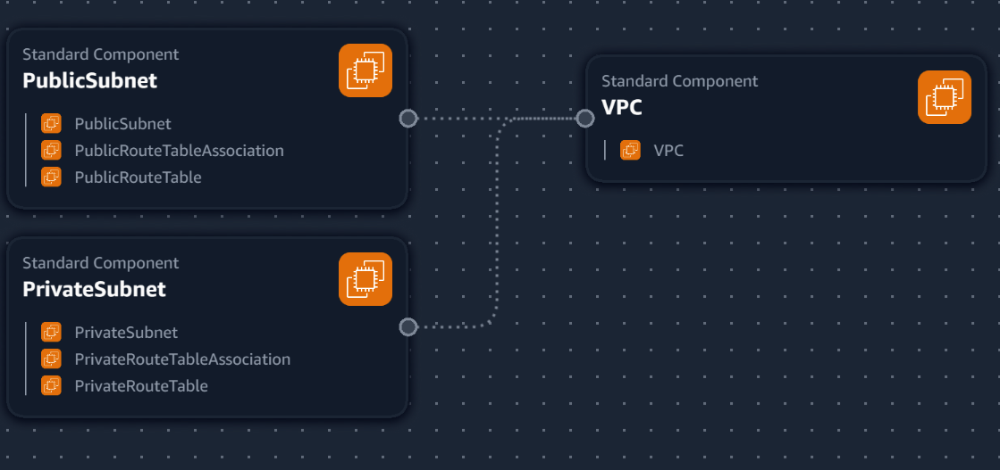
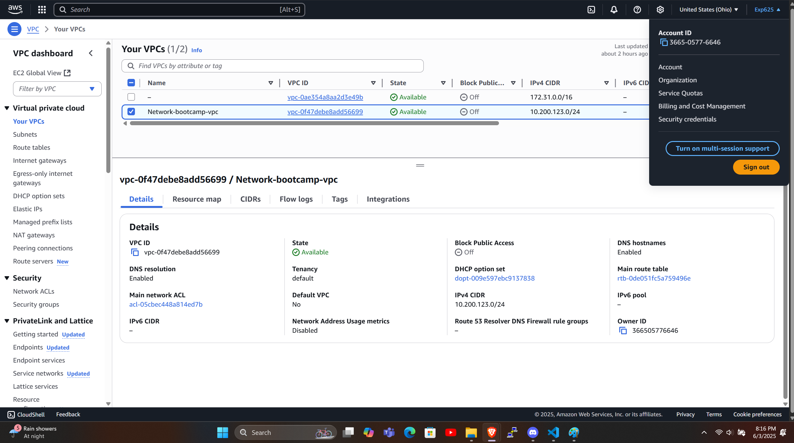

## VPC Settings 

These are the VPC Settings we observed Tim setup for our cloud enviroment in AWS:

- VPC IPv4 CIDER Block: 10.200.123.0/24
- IPv6 CIDR Block: No
- Number of AZ's: 1
- Number of public subnets: 1
- Number of private subnets: 1
- NAT Gateways: None
- VPC Endpoints: None
- DNS Options: Enable DNS Hostnames
- DNS Options: Enable DNS Resolution 

## Generated and Reviewed CFN Template

Watching the instructors videos, I noted the VPC settings, provided this to LLM  to produce the CFN, I reviewed the CFN template to automate the provision of the VPC infrastructure.

- I had to ask the LLM to refactor the parameters so that it would not hardcode values and the template is more reasonable. 

## Generated Deploy Script

Using Chat GPT generated a bash script `Bin/deply`  

I changed the shebang to work for all OS platforms

## Visulization in Infrastructure Composer 

## Installing AWS CLI 

In order to deploy cia AWS CLI we need to install it.

We follow the install intructions:
https://docs.aws.amazon.com/cli/latest/userguide/getting-started-install.html

## Deploy Reasource in AWS 

This is the resource to AWS

